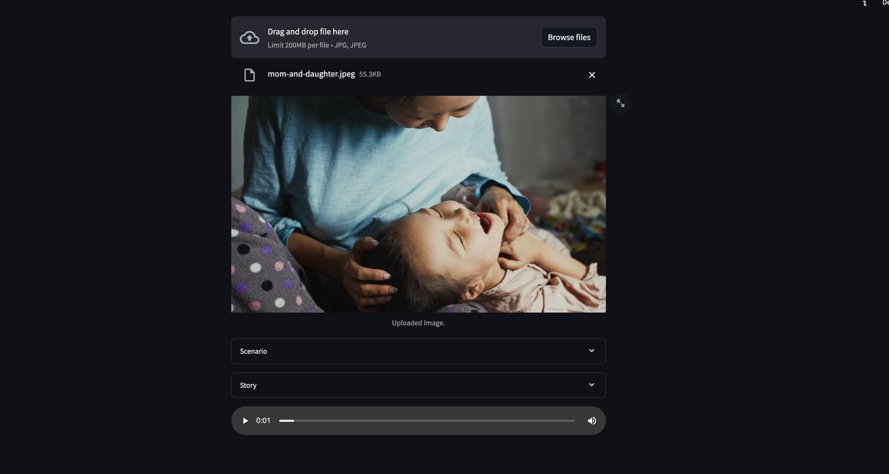

# PicTalk
 Bringing Images to Life with Sound

### Run
To run the project, follow these steps:

1. Activate the virtual environment:
    ```shell
    poetry shell
    ```

2. Install the project dependencies:
    ```shell
    poetry install
    ```

3. Copy the sample environment file:
    ```shell
    cp .sample.env .env
    ```

4. Add the necessary secrets to the `.env` file.

5. Start the application:
    ```shell
    streamlit run main.py
    ```


### Demo


#### Image


### Scenario.
there is a woman holding a baby in her lap and smiling

### Story.
In a small village nestled among the hills, a young mother sat on the front porch of her wooden cottage, cradling her newborn baby in her arms. The warm sun painted golden hues across the sky, casting a soft glow on the pair. The woman's eyes sparkled with joy as she gazed down at her child, a smile lighting up her face. In that moment, surrounded by the gentle sounds of nature, a bond of unconditional love and happiness enveloped them both.

### Audio
<audio controls>
    <source src="/data/output-2024-04-28-13-06-24.flac" type="audio/mpeg">
    Your browser does not support the audio element.
</audio>

[Audio](/data/output-2024-04-28-13-06-24)
